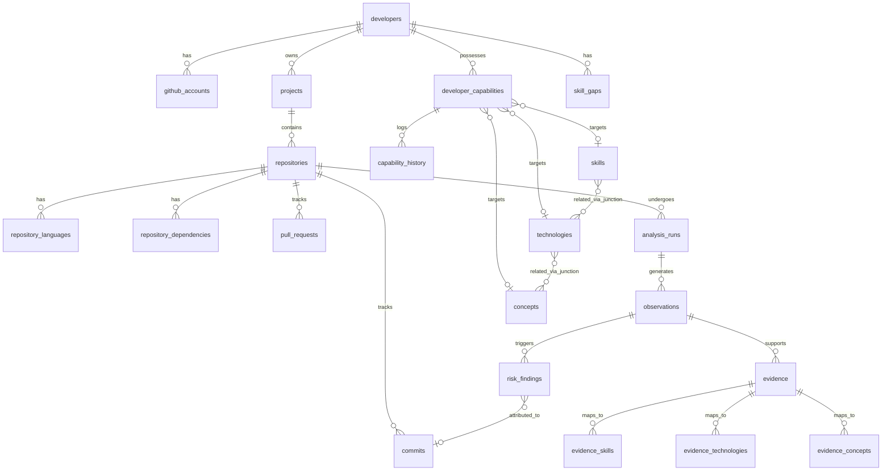

# 11. Database Schema

## Overview
This document specifies the exact PostgreSQL schema for DevTwin. It uses normalized relational tables, UUID primary keys for internal data, and explicitly separates external IDs (e.g., GitHub IDs) to ensure extensibility. 

## Capability Target Design Decision
**Decision**: Option A (Separate nullable foreign keys with CHECK constraints - "Exclusive Arc").
**Reason**: In `developer_capabilities` and `skill_gaps`, we need to target either a `skill_id`, `technology_id`, or `concept_id`. A generic `target_entity_id` polymorphic foreign key prevents PostgreSQL from enforcing referential integrity. By using three nullable foreign keys and a `CHECK (num_nonnulls(skill_id, technology_id, concept_id) = 1)`, we guarantee strict foreign key constraints, correct `ON DELETE CASCADE` behavior, and high-performance querying without complex joins.

## ER Diagram

## Table Specifications

### 1. Identity & Projects

**`developers`**
Purpose: Internal developer identity.
| Column | Type | Nullable | Default | Constraints | Description |
|---|---|---|---|---|---|
| id | uuid | NO | uuid_generate_v4() | PK | Internal Developer ID |
| created_at | timestamptz | NO | now() | | Timestamp |
| updated_at | timestamptz | NO | now() | | Timestamp |

**`github_accounts`**
Purpose: GitHub integration mapping. Secrets must be stored externally (e.g., HashiCorp Vault, encrypted KMS fields), NOT in plaintext here.
| Column | Type | Nullable | Default | Constraints | Description |
|---|---|---|---|---|---|
| id | uuid | NO | uuid_generate_v4() | PK | Internal ID |
| developer_id | uuid | NO | | FK(developers.id) ON DELETE CASCADE | Owner |
| github_id | bigint | NO | | UNIQUE | GitHub's immutable User ID |
| username | text | NO | | | GitHub handle |
| access_token_enc| text | YES | | | Encrypted token references only |

**`projects`**
Purpose: Logical grouping of repositories.
| Column | Type | Nullable | Default | Constraints | Description |
|---|---|---|---|---|---|
| id | uuid | NO | uuid_generate_v4() | PK | Internal ID |
| developer_id | uuid | NO | | FK(developers.id) ON DELETE CASCADE | Owner |
| name | text | NO | | | Project name |

### 2. Repository Domain

**`repositories`**
Purpose: Core repository metadata.
| Column | Type | Nullable | Default | Constraints | Description |
|---|---|---|---|---|---|
| id | uuid | NO | uuid_generate_v4() | PK | Internal ID |
| project_id | uuid | YES | | FK(projects.id) ON DELETE SET NULL | Associated project |
| github_repo_id | bigint | YES | | UNIQUE | External GitHub Repo ID |
| owner_login | text | NO | | | e.g., 'facebook' |
| name | text | NO | | | e.g., 'react' |
| full_name | text | NO | | UNIQUE | e.g., 'facebook/react' |
| url | text | NO | | | Repository clone/view URL |
| default_branch | text | NO | 'main' | | |
| visibility | text | NO | | | 'public' or 'private' |
| updated_at | timestamptz | NO | now() | | Metadata sync timestamp |

**`repository_languages`**
Purpose: Language breakdown per repo.
| Column | Type | Nullable | Default | Constraints | Description |
|---|---|---|---|---|---|
| id | uuid | NO | uuid_generate_v4() | PK | Internal ID |
| repository_id | uuid | NO | | FK(repositories.id) ON DELETE CASCADE | Repo |
| language | text | NO | | | Language name |
| bytes | bigint | NO | | | LOC/Bytes |
*Constraints*: UNIQUE(repository_id, language)

**`repository_dependencies`**
Purpose: Tracked package dependencies.
| Column | Type | Nullable | Default | Constraints | Description |
|---|---|---|---|---|---|
| id | uuid | NO | uuid_generate_v4() | PK | Internal ID |
| repository_id | uuid | NO | | FK(repositories.id) ON DELETE CASCADE | Repo |
| ecosystem | text | NO | | | e.g., 'npm' |
| package_name | text | NO | | | e.g., 'react' |
| version_constraint| text | YES | | | e.g., '^18.0.0' |
*Constraints*: UNIQUE(repository_id, ecosystem, package_name)

**`commits`**
Purpose: Author attribution and risk tracing.
| Column | Type | Nullable | Default | Constraints | Description |
|---|---|---|---|---|---|
| id | uuid | NO | uuid_generate_v4() | PK | Internal ID |
| repository_id | uuid | NO | | FK(repositories.id) ON DELETE CASCADE | Repo |
| sha | text | NO | | | Full git commit SHA |
| author_name | text | YES | | | Git author name |
| author_email | text | YES | | | Git author email |
| committed_at | timestamptz | NO | | | Git commit timestamp |
*Constraints*: UNIQUE(repository_id, sha)

**`pull_requests`**
Purpose: Collaboration evidence.
| Column | Type | Nullable | Default | Constraints | Description |
|---|---|---|---|---|---|
| id | uuid | NO | uuid_generate_v4() | PK | Internal ID |
| repository_id | uuid | NO | | FK(repositories.id) ON DELETE CASCADE | Repo |
| pr_number | integer| NO | | | GitHub PR Number |
| state | text | NO | | | 'open', 'closed', 'merged' |
*Constraints*: UNIQUE(repository_id, pr_number)

### 3. Analysis Pipeline

**`analysis_jobs`**
Purpose: High-level queue request.
| Column | Type | Nullable | Default | Constraints | Description |
|---|---|---|---|---|---|
| id | uuid | NO | uuid_generate_v4() | PK | Internal ID |
| repository_id | uuid | NO | | FK(repositories.id) ON DELETE CASCADE | Target Repo |
| status | text | NO | 'QUEUED' | | e.g., QUEUED, PROCESSING, DONE |

**`analysis_runs`**
Purpose: Specific, bounded execution of the analysis logic. Reproducible.
| Column | Type | Nullable | Default | Constraints | Description |
|---|---|---|---|---|---|
| id | uuid | NO | uuid_generate_v4() | PK | Internal ID |
| repository_id | uuid | NO | | FK(repositories.id) ON DELETE CASCADE | Target Repo |
| status | text | NO | | CHECK(status IN ('QUEUED', 'FETCHING', 'MINING', 'SKILL_GRAPH', 'CODE_RISK', 'CAPABILITY', 'COMPLETED', 'FAILED')) | Run lifecycle state |
| analyzer_version| text | NO | | | Version of analysis engine |
| schema_version | text | NO | | | Schema version used |
| started_at | timestamptz | YES | | | |
| completed_at | timestamptz | YES | | | |

**`observations`**
Purpose: Directly detected facts.
| Column | Type | Nullable | Default | Constraints | Description |
|---|---|---|---|---|---|
| id | uuid | NO | uuid_generate_v4() | PK | Internal ID |
| analysis_run_id | uuid | NO | | FK(analysis_runs.id) ON DELETE CASCADE | Source Run |
| type | text | NO | | | e.g., 'DEPENDENCY_FOUND' |
| source_tool | text | NO | | | e.g., 'ast-parser-v2' |
| source_reference| jsonb| YES | | | e.g., `{"file": "src/app.ts", "line": 5}` |
| confidence | numeric| YES | | CHECK(confidence >= 0 AND confidence <= 1) | Tool's certainty |
| observed_at | timestamptz | NO | now() | | |

### 4. SkillGraph Taxonomy

**`skills`**, **`technologies`**, **`concepts`**
Columns: `id` (uuid PK), `name` (text UNIQUE). Technologies have `type` (text).

**Junctions (`skill_technologies`, `skill_concepts`, `technology_concepts`)**
Columns: entity1_id, entity2_id. PK(entity1, entity2). Both FKs cascade delete.

**`skill_relationships`**
| Column | Type | Nullable | Default | Constraints | Description |
|---|---|---|---|---|---|
| source_id | uuid | NO | | FK(skills.id) ON DELETE CASCADE | |
| target_id | uuid | NO | | FK(skills.id) ON DELETE CASCADE | |
| relation_type | text | NO | | | e.g., 'REQUIRES', 'RELATED_TO' |
*Constraints*: PK(source_id, target_id, relation_type)

### 5. Evidence

**`evidence`**
Purpose: Contextualized observation supporting a capability.
| Column | Type | Nullable | Default | Constraints | Description |
|---|---|---|---|---|---|
| id | uuid | NO | uuid_generate_v4() | PK | Internal ID |
| observation_id | uuid | YES | | FK(observations.id) ON DELETE SET NULL | Nullable for manual |
| type | text | NO | | CHECK(type IN ('MENTION', 'USAGE', 'APPLIED_ENGINEERING', 'DEMONSTRATED_OUTCOME')) | Evidence Hierarchy |
| strength | numeric| NO | | CHECK(strength BETWEEN 0 AND 1) | Base weight |
| directness | numeric| NO | | CHECK(directness BETWEEN 0 AND 1) | Connection strength |
| reliability | numeric| NO | | CHECK(reliability BETWEEN 0 AND 1) | Source trust |
| polarity | numeric| NO | | CHECK(polarity BETWEEN -1 AND 1) | Positive/Negative |
| recency | timestamptz | NO | | | Timestamp of actual event |

**Evidence Junctions (`evidence_skills`, `evidence_technologies`, `evidence_concepts`)**
Purpose: Maps evidence to taxonomy. `evidence_id`, `target_id`. PK(evidence, target). FKs cascade delete.

### 6. Capability & Gap

**`developer_capabilities`**
Purpose: Current state of developer capability.
| Column | Type | Nullable | Default | Constraints | Description |
|---|---|---|---|---|---|
| id | uuid | NO | uuid_generate_v4() | PK | Internal ID |
| developer_id | uuid | NO | | FK(developers.id) ON DELETE CASCADE | Owner |
| skill_id | uuid | YES | | FK(skills.id) ON DELETE CASCADE | |
| technology_id | uuid | YES | | FK(technologies.id) ON DELETE CASCADE | |
| concept_id | uuid | YES | | FK(concepts.id) ON DELETE CASCADE | |
| score | numeric| NO | | CHECK(score BETWEEN 0 AND 1) | Current score |
| confidence | numeric| NO | | CHECK(confidence BETWEEN 0 AND 1) | Confidence |
| scoring_version | text | NO | | | Calculation model used |
| updated_at | timestamptz | NO | now() | | |
*Constraints*: 
- CHECK `(num_nonnulls(skill_id, technology_id, concept_id) = 1)`
- UNIQUE `(developer_id, skill_id, technology_id, concept_id)`

**`capability_history`**
Purpose: Immutable history of capability states.
| Column | Type | Nullable | Default | Constraints | Description |
|---|---|---|---|---|---|
| id | uuid | NO | uuid_generate_v4() | PK | Internal ID |
| capability_id | uuid | NO | | FK(developer_capabilities.id) ON DELETE CASCADE | Target capability |
| analysis_run_id | uuid | YES | | FK(analysis_runs.id) ON DELETE SET NULL | Run that caused update |
| score | numeric| NO | | | |
| confidence | numeric| NO | | | |
| scoring_version | text | NO | | | |
| recorded_at | timestamptz | NO | now() | | |

**`skill_gaps`**
Purpose: Tracked deltas between target and current capability.
| Column | Type | Nullable | Default | Constraints | Description |
|---|---|---|---|---|---|
| id | uuid | NO | uuid_generate_v4() | PK | Internal ID |
| developer_id | uuid | NO | | FK(developers.id) ON DELETE CASCADE | Owner |
| target_skill_id | uuid | YES | | FK(skills.id) ON DELETE CASCADE | |
| target_technology_id| uuid | YES | | FK(technologies.id) ON DELETE CASCADE | |
| target_concept_id | uuid | YES | | FK(concepts.id) ON DELETE CASCADE | |
| target_score | numeric| NO | | | Required level |
| current_score | numeric| NO | | | Actual level |
| gap_value | numeric| NO | | | Delta |
| confidence | numeric| NO | | | Confidence in gap |
*Constraints*: CHECK `(num_nonnulls(target_skill_id, target_technology_id, target_concept_id) = 1)`

### 7. CodeRisk

**`risk_findings`**
Purpose: Tracked repository risks.
| Column | Type | Nullable | Default | Constraints | Description |
|---|---|---|---|---|---|
| id | uuid | NO | uuid_generate_v4() | PK | Internal ID |
| repository_id | uuid | NO | | FK(repositories.id) ON DELETE CASCADE | Repo |
| analysis_run_id | uuid | NO | | FK(analysis_runs.id) ON DELETE CASCADE | Source Run |
| observation_id | uuid | NO | | FK(observations.id) ON DELETE CASCADE | Triggering obs |
| commit_id | uuid | YES | | FK(commits.id) ON DELETE SET NULL | Optional attribution |
| category | text | NO | | CHECK(category IN ('SECURITY', 'RELIABILITY', 'TESTING', 'MAINTAINABILITY', 'DEPENDENCY', 'ARCHITECTURE')) | |
| severity | text | NO | | CHECK(severity IN ('LOW', 'MEDIUM', 'HIGH', 'CRITICAL')) | Impact |
| confidence | numeric| NO | | CHECK(confidence BETWEEN 0 AND 1) | Detection certainty |
| risk_type | text | NO | | | Specific rule ID |
| file_path | text | YES | | | |
| line_start | integer| YES | | | |
| line_end | integer| YES | | | |

## Critical Indexes
- `idx_devcap_dev` on `developer_capabilities(developer_id)`: Dashboards load developer capabilities constantly.
- `idx_caphist_cap_time` on `capability_history(capability_id, recorded_at DESC)`: For graphing trendlines.
- `idx_risk_repo_sev` on `risk_findings(repository_id, severity)`: Filtering repository risks.
- `idx_obs_run` on `observations(analysis_run_id)`: Fetching all raw data for a specific run.
- `idx_runs_repo` on `analysis_runs(repository_id, started_at DESC)`: Finding the latest analysis run.
- `idx_github_repo` on `repositories(github_repo_id)`: Fast sync lookups from webhooks.

## Row Level Security (RLS) Strategy
- **Developers**: `SELECT`, `UPDATE` allowed where `id = auth.uid()`.
- **Capabilities & Evidence**: Allowed where `developer_id = auth.uid()`.
- **Repositories**: Allowed if joined to `projects` where `developer_id = auth.uid()`.
- **Taxonomy (Skills/Tech)**: `SELECT` allowed for all authenticated users (Public taxonomy).
