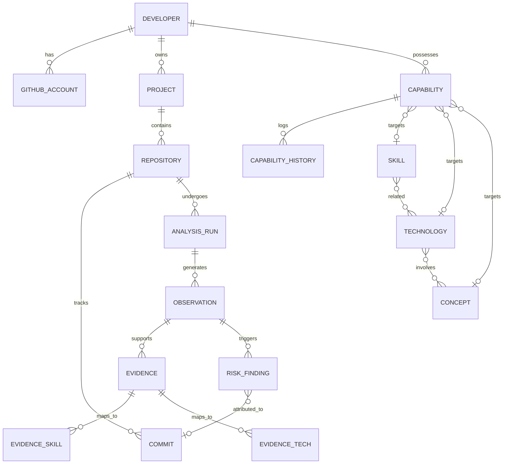

# 11. Database Schema

## Overview
DevTwin uses a normalized PostgreSQL relational database. The schema is specifically designed to support the SkillGraph via junction tables, enforce strict data provenance from analysis runs, and maintain temporal capability history.

For the exhaustive column-level specifications, constraints, and data types, see [DOMAIN_MODEL.md](file:///e:/Minor_Project/DevTwin/docs/DOMAIN_MODEL.md).

## ER Diagram

### Diagram Explanation
The ER diagram illustrates the core flow of data:
1. A **Developer** connects an identity and owns **Repositories**.
2. A **Repository** undergoes an **Analysis Run**, which produces raw **Observations**.
3. **Observations** act as the fork in the road: they can produce negative **Risk Findings** (CodeRisk) or contextualized **Evidence**.
4. **Evidence** is mapped via junction tables to the shared **SkillGraph** taxonomy (Skills, Technologies, Concepts).
5. The aggregation of Evidence updates a developer's **Capability** state, which maintains a strict **Capability History** for temporal tracking.

## Capability Target Polymorphism
To cleanly target a Skill, Technology, or Concept from the `developer_capabilities` table without using an unsafe polymorphic foreign key (e.g., `target_id`, `target_type`), the schema uses the **Exclusive Arc** pattern. The table has three nullable foreign keys (`skill_id`, `technology_id`, `concept_id`) with a database-level `CHECK` constraint ensuring exactly one is populated. This preserves hard referential integrity and cascading behaviors.
